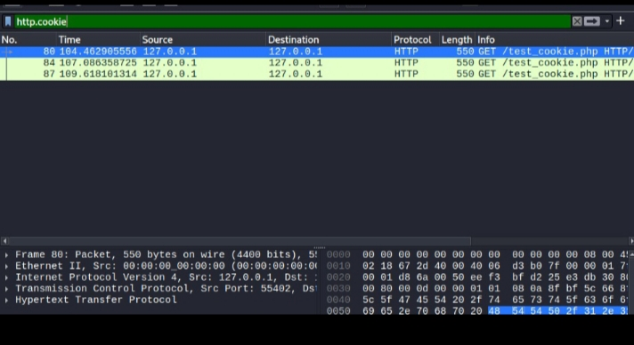

Final Project Report: All Network Traffic Analysis
​This documentation covers the step-by-step process of monitoring network traffic and analyzing session security.
​1. Project Overview
​The objective was to analyze real-time network traffic and demonstrate the security risks associated with session management and unencrypted data flow.
​2. Technical Procedures
​Traffic Capture: Used Wireshark to monitor all incoming and outgoing network packets during active sessions.
​Metasploit Integration: Generated network traffic via the Metasploit Framework to observe the "Connect" status and data exchange between systems.
​Connectivity Audit: Verified stable communication channels to ensure accurate data collection.
​3. Session Hijacking & Cookie Analysis
​Cookie Finding: Successfully intercepted the network traffic to find and extract the session cookie: Zakia-Rani-786.
​Session Checking: Performed a manual check of the captured session data to verify its validity.
​Hijacking Demonstration: Analyzed how captured cookies can be used to perform Session Hijacking, allowing unauthorized access to user accounts.
​4. Conclusion & Results
​Key Finding: Proved that unencrypted network traffic is highly vulnerable to sniffing and session theft.
​Outcome: Successfully demonstrated the complete lifecycle of a network session, from initiation to potential hijacking

